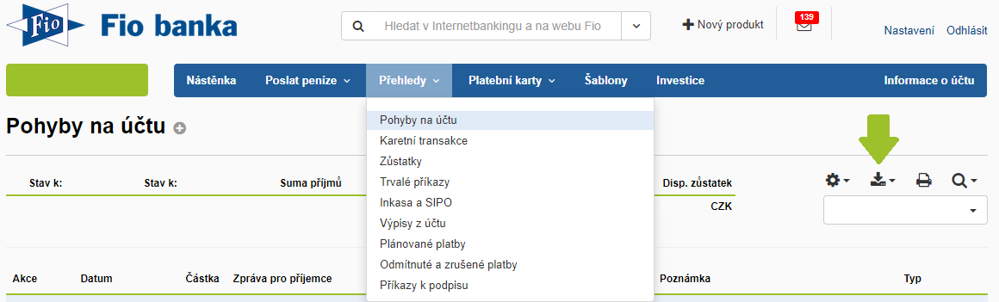
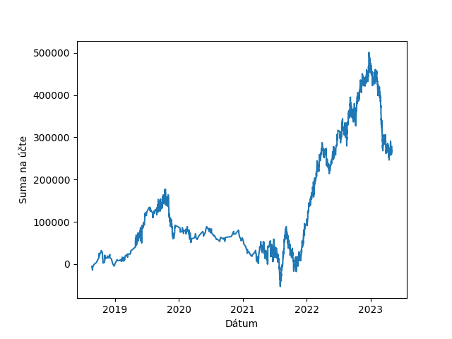

## Fio graph generator
Generates graph from exported csv file from fio bank.  
Works only for one currency account.

Download CSV file from fio bank:

Copy the file into project folder, name it "fio.csv" or any other name with changing the filename in constraint in main.py file.  
Example output:  
